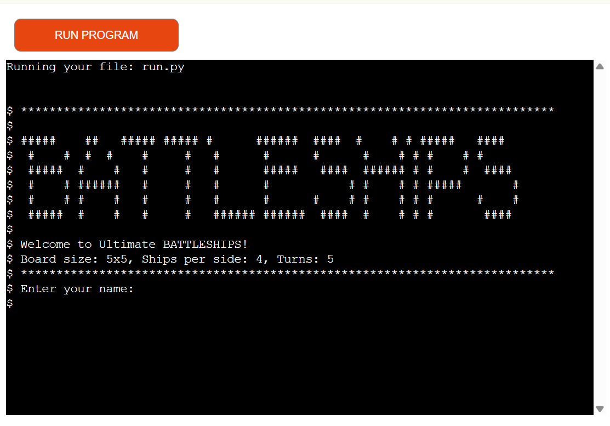
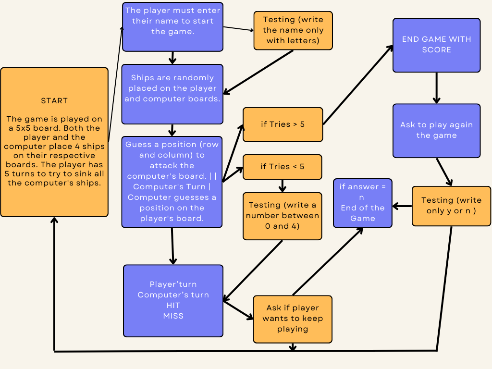
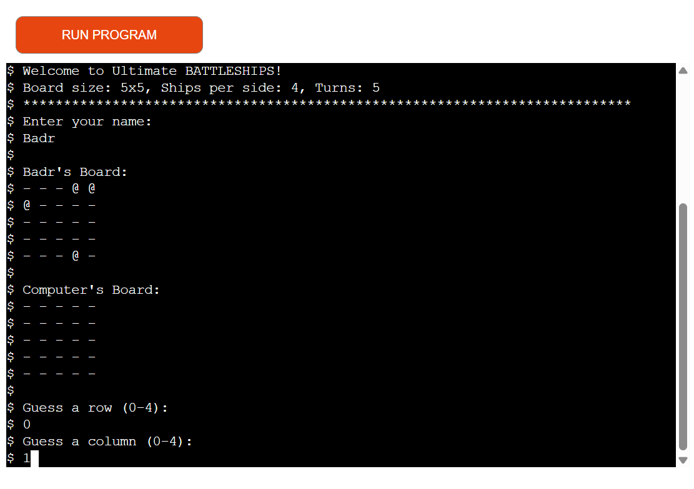
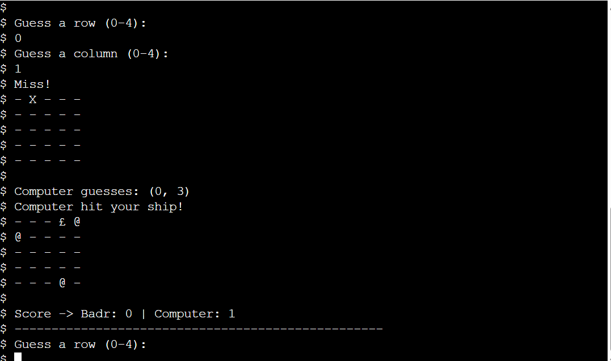
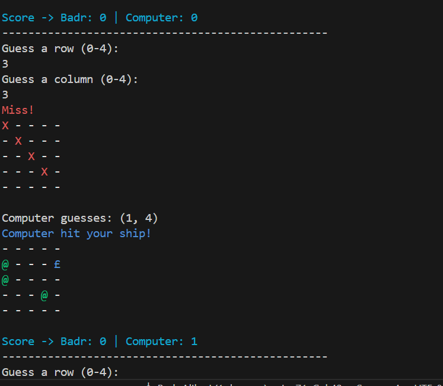
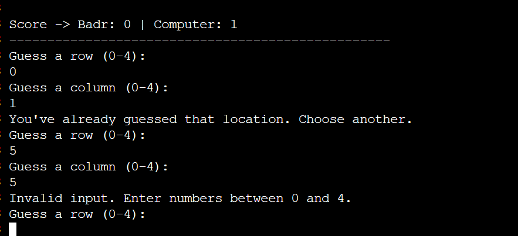
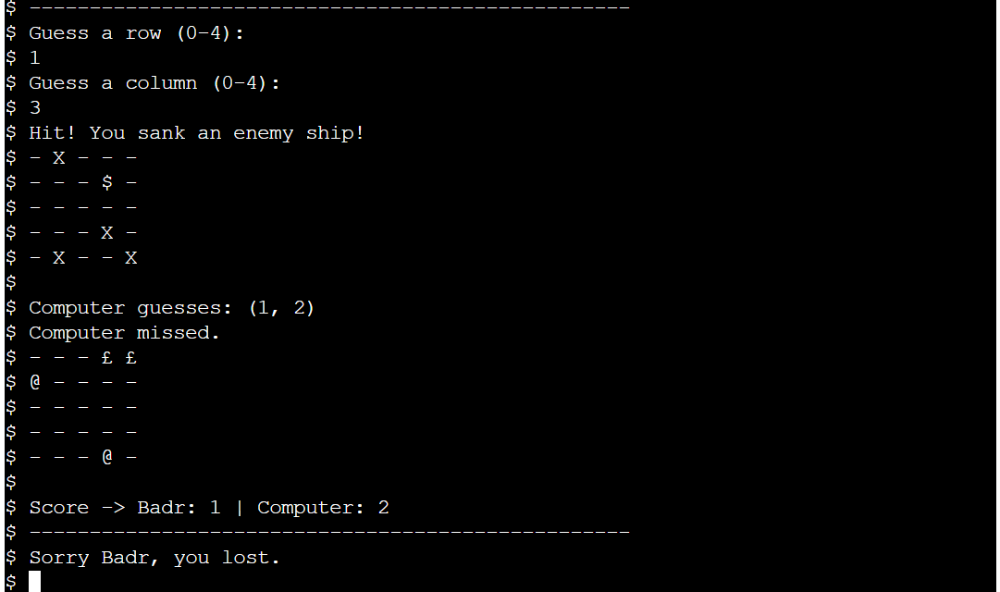
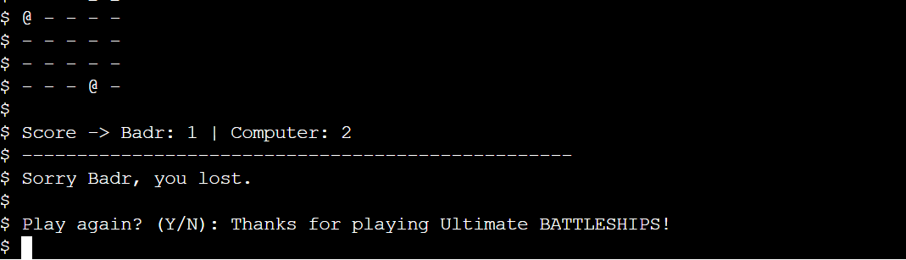
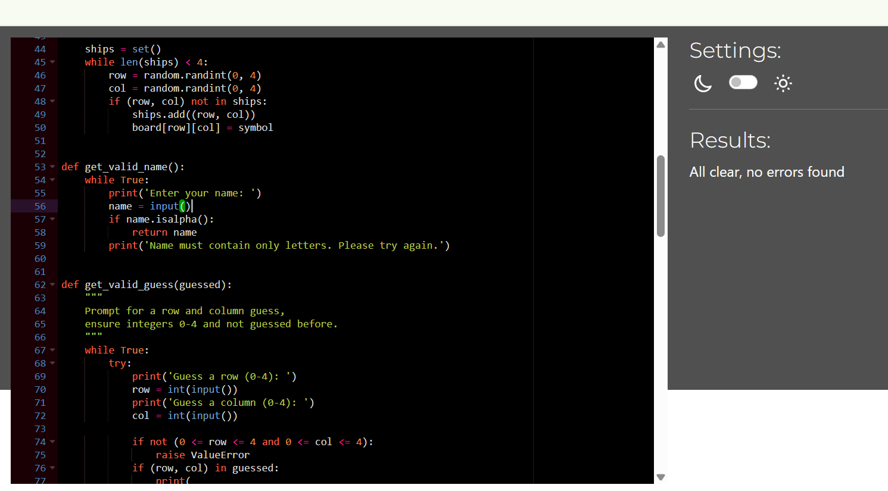

## Table of Contents

1. [User Experience (UX)](#user-experience-ux)
2. [Project Goals](#project-goals)
3. [User Stories](#user-stories)
4. [Color Scheme](#color-scheme)
5. [Game Mechanics](#game-mechanics)
6. [Flowchart](#flowchart)
7. [Features](#features)
8. [Technologies Used](#technologies-used)
9. [Testing](#testing)
10. [Deployment](#deployment)
11. [Credits & Acknowledgements](#credits--acknowledgements)

---



**Ultimate Battleships** is a command‑line implementation of the classic Battleships game, written in pure Python. You face off against a computer opponent on a 5×5 grid, each side placing 4 ships and having up to 5 turns to sink the enemy fleet.

> **Live demo:** _https://mon-battleship-221b8a85dbc3.herokuapp.com/_


## Project Overview

Ultimate Battleships brings the naval combat experience to your terminal. It combines:

- **Interactive CLI** with clear prompts  
- **Colorized output** (hits in yellow, misses in red, ships in green/blue)  
- **Pure Python**—no web frameworks required for core gameplay  

---

## User Experience (UX)

* **Immersive CLI**: The game runs purely in the terminal, preserving the feel of a classic battleship match.
* **Clear Feedback**: Hits, misses, and scores are displayed with colored text to guide the player.
* **Replayability**: At the end, the player is prompted to play again or exit.

## Project Goals

* Build a self-contained Python application that does not require any external servers or browsers.
* Use only built-in `input()`/`print()` for I/O, enhanced by the `colorama` library for better readability.
* Deploy the game to Heroku to demonstrate seamless terminal hosting.

## User Stories

**As a user, I want to receive information about the main objective of the program.**

* The welcome banner clearly explains the game’s goal and rules.

**As a user, I want to easily understand what input is needed on each step.**

* Prompts like `Enter your name:`, `Guess a row (0-4):`, and `Guess a column (0-4):` guide the player.
* Prompt text appears in green to stand out.

**As a user, I want to receive clear feedback in case I provide the wrong input.**

* Invalid entries (non‑numeric, out of range, duplicate coordinates) produce a red error message.

**As a user, I want to review the game state after each turn.**

* After each shot, the board displays hits and misses with colored symbols.

**As a user, I want the final result to be obvious.**

* At game end, a clear win/lose/draw message appears in color.

## Color Scheme (with visual studio or git bash)

| Element            | Color  |
| ------------------ | ------ |
| Player ships (@)   | Green  |
| Computer hits (\$) | Yellow |
| Misses (X)         | Red    |
| Water (-)          | White  |
| Computer ships (£) | Blue   |

*Implement using [Colorama](https://pypi.org/project/colorama/)*

## Game Mechanics

1. Initialize three 5×5 boards: **player**, **computer**, and **display**.
2. Randomly place 4 ships (`@` for player, `'` for computer).
3. For up to 5 turns or until all ships sink:

   * Player guesses a coordinate (row, column).
   * Mark hit (`$`) or miss (`X`) on **display** board.
   * Computer makes a random guess on **player** board.
4. Track `player_score` and `computer_score`.
5. End when turns run out or a side wins, then prompt to replay.

## Flowchart

Place your flowchart image in `assets/flowchart.png` and reference it below:



---

## Features

### 🎮 Core Gameplay  
- **5×5 Grid & 4 Ships**  
  Each side (you and the computer) has a 5×5 board and places 4 ships at random.  
- **Turn‑Based Combat**  
  You have up to 5 turns to sink all enemy ships before the game ends.

  

### 🌈 Colorized Output (supported in Git Bash and VS Code terminals)
- **Hits** (`$`) displayed in **yellow**  
- **Misses** (`X`) displayed in **red**  
- **Your ships** (`@`) displayed in **green**  
- **Computer’s hits** (`£`) displayed in **blue**  
- **Water** (`-`) displayed in **white**  
  Powered by the [`colorama`](https://pypi.org/project/colorama/) library for clear, eye‑catching feedback.

  

  

### ✅ Robust Input Validation  
- Ensures **row** and **column** are integers between **0** and **4**.  
- Rejects **duplicate guesses** and prompts again when invalid.



### 📊 Score Tracking & Turn Counter  
- Displays **current turn** (1–5) and **remaining turns** each round.  
- Shows both **player** and **computer** scores live after each shot.



### 🔁 Replayability  
- At game end (win/lose/draw), you’re prompted to **play again** or **exit**.


 

---

## Technologies Used

- **Language**: Python 3.13  
  Chosen for its clear syntax, powerful standard library, and wide community support.

- **Libraries**:  
  - `colorama` 0.4.6 — provides cross‑platform ANSI color support for terminal output.

- **Hosting**: Heroku  
  Deployed as an interactive web‑terminal using a small Node.js server with `node-pty` to bridge between the browser’s xterm.js frontend and the Python backend.

- **Version Control**: Git & GitHub  
  Tracks all changes, enables collaboration, and powers automated deployments via Heroku’s Git integration.

---

## Testing

### Code Validation

* All Python code was checked against PEP8 standards using an online validator.



### Manual Testing

| Feature                  | Outcome                                         | Example Input         | Pass/Fail |
| ------------------------ | ----------------------------------------------- | --------------------- | --------- |
| Name input validation    | Rejects empty or non-letter names               | `(empty)`             | Pass      |
| Row/col validation       | Rejects non-integers and out-of-range values    | `5`, `-1`, `a`        | Pass      |
| Duplicate guess handling | Prompts again if the same cell is guessed twice | same coordinates      | Pass      |
| Hit detection            | Marks `$` and increments score on hit           | guessing a ship coord | Pass      |
| Miss detection           | Marks `X` on miss                               | guessing empty cell   | Pass      |
| Turn limit enforcement   | Stops after five turns                          | after 5 shots         | Pass      |
| Endgame scoring          | Displays correct win/lose/draw message          | various score states  | Pass      |

## Bug Fixes

- **Replay prompt wasn’t visible**  
  The `"Play again?"` message didn’t show up when passed directly into `input()`. To fix this, I split it into a separate `print` call:

  ```python
  # Before
  replay = input('Play again? (Y/N): ').strip().lower()

  # After
  print('Play again? (Y/N): ')
  replay = input().strip().lower()


## Known Issues & Future Improvements

### Color output on Heroku
Currently, colored text (via Colorama) only renders when you run:

```bash
heroku run python run.py


---

## Deployment

Follow these steps to deploy **Ultimate Battleships** to Heroku:

1. **Prepare your code**  
   - Ensure your `requirements.txt` is up to date:  
     ```bash
     pip freeze > requirements.txt
     ```  
   - Commit all changes and push to your GitHub repository.

2. **Create a new Heroku app**  
   - Log in to the Heroku Dashboard and click **“Create new app”**.  
   - Choose a unique **App name** (e.g. `ultimate‑battleships`) and your preferred region.  
   - Click **Create app**.

3. **Configure buildpacks**  
   - Under the **Settings** tab, find **Buildpacks** and click **Add buildpack**.  
   - Add **heroku/python**.  
   - Click **Add buildpack** again and add **heroku/nodejs**.  
   - Ensure **python** is listed above **nodejs**.

4. **Set environment variables** (optional)  
   - Still under **Settings**, click **Reveal Config Vars**.  
   - If your game uses any credentials, add them here (e.g. `CREDS`, `API_KEY`).  
   - By default, Heroku will provide a `PORT` variable—no need to set it manually.

5. **Link your GitHub repo**  
   - Switch to the **Deploy** tab.  
   - Under **Deployment method**, choose **GitHub** and click **Connect to GitHub**.  
   - Search for your repository (e.g. `YourUsername/UltimateBattleships`) and click **Connect**.

6. **Deploy your app**  
   - Choose **Enable Automatic Deploys** (optional) to deploy on every push to the `main` branch.  
   - Or click **Deploy Branch** under **Manual deploy** to trigger the first release.  

7. **Open your live game**  
   - Once the build completes, click **View** or run:  
     ```bash
     heroku open
     ```  
   - To interact with the CLI in your local terminal via Heroku, run:  
     ```bash
     heroku run python run.py
     ```

Your Battleships game is now live and playable through a browser‑embedded terminal or directly via the Heroku CLI!  

---

## Credits

### Content  
- Core game mechanics and flow inspired by the “Morpion” (Tic‑Tac‑Toe) tutorial on [Pirple.com](https://www.pirple.com).  
- Ship placement, turn logic and win/draw conditions adapted and extended for the 5×5 Battleships format.

### Media  
- ASCII art banner created and modified with [ASCII Generator](https://ascii-generator.site/).  
- Game board mockups and flowcharts hand‑drawn and exported as PNG for the `assets/` folder.

### Code   
- Color handling via the `colorama` documentation and examples.

### Acknowledgements  
- **My partner**, for unwavering support and encouragement throughout this project.  
- **My tutor, Marcel**, for constructive feedback and guidance.  
- **Pirple.com**, for the initial “Morpion” tutorial that sparked this Battleships implementation.  
- **Code Institute** and its Slack community, for providing the resources and peer help needed to complete this project.  
